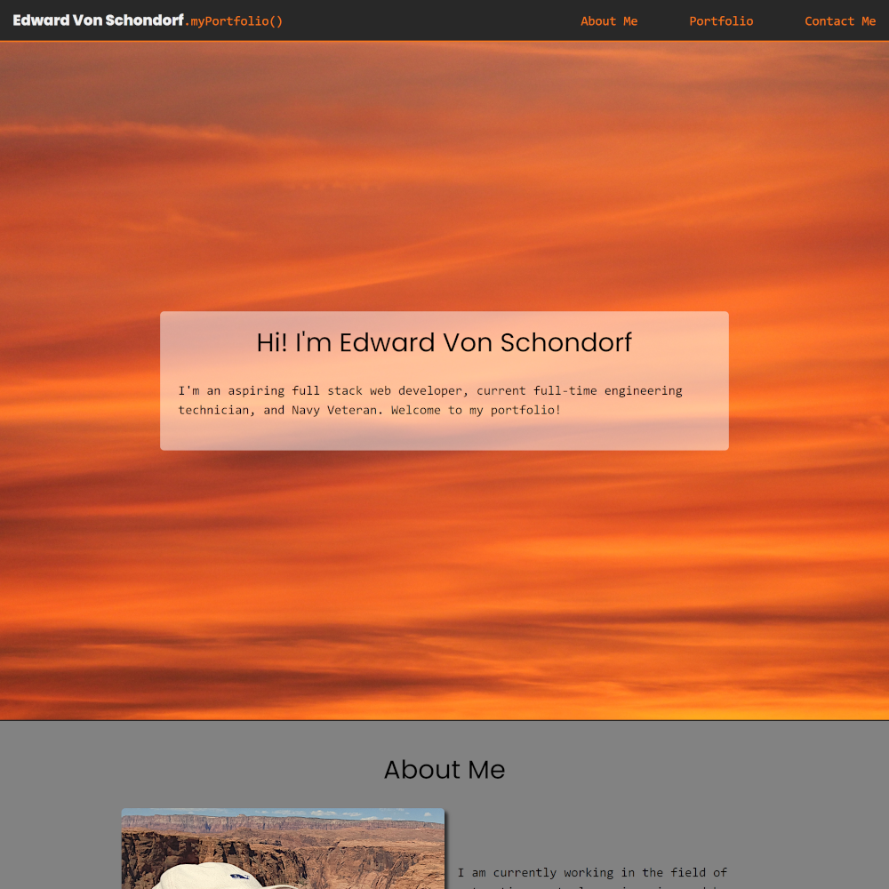
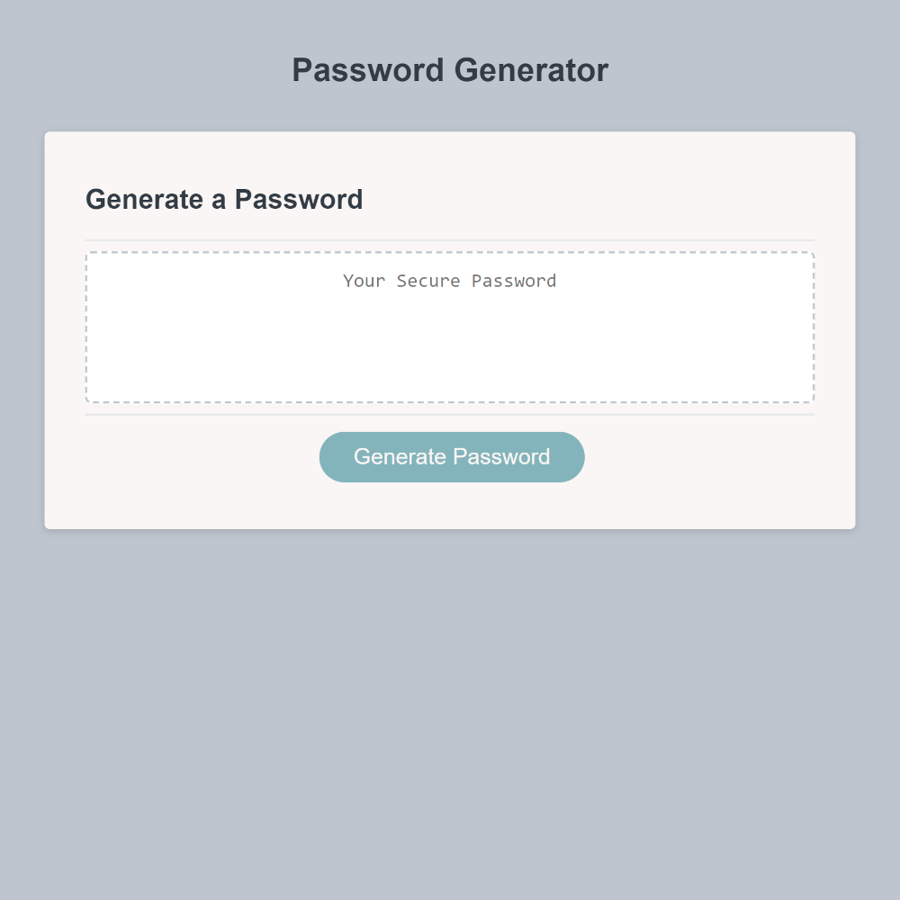
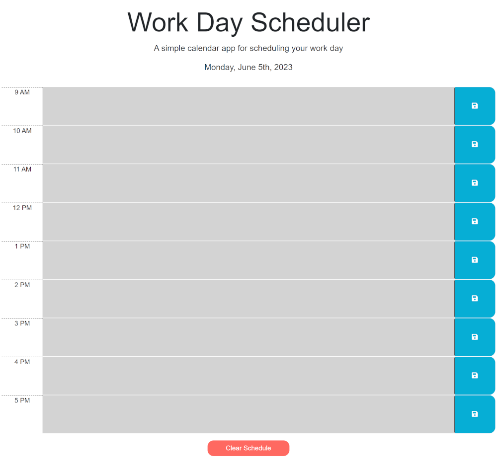
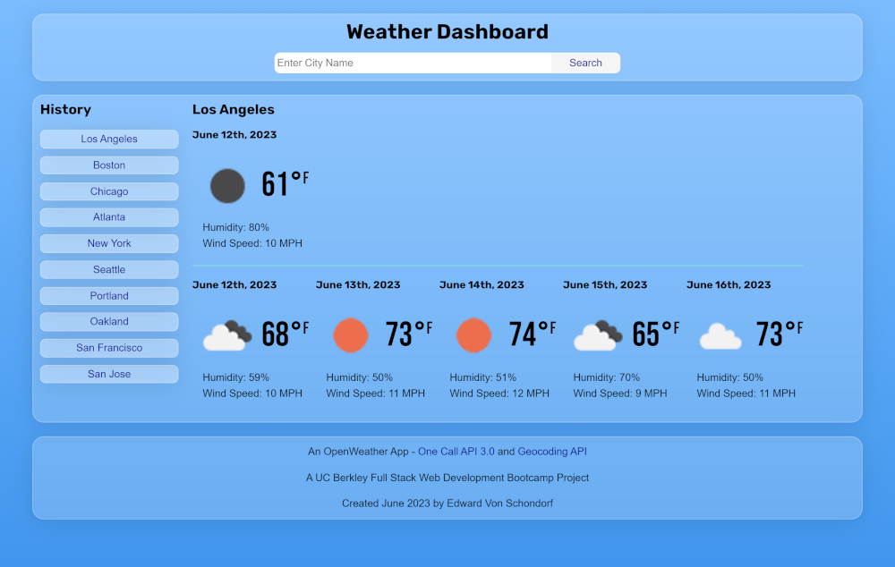
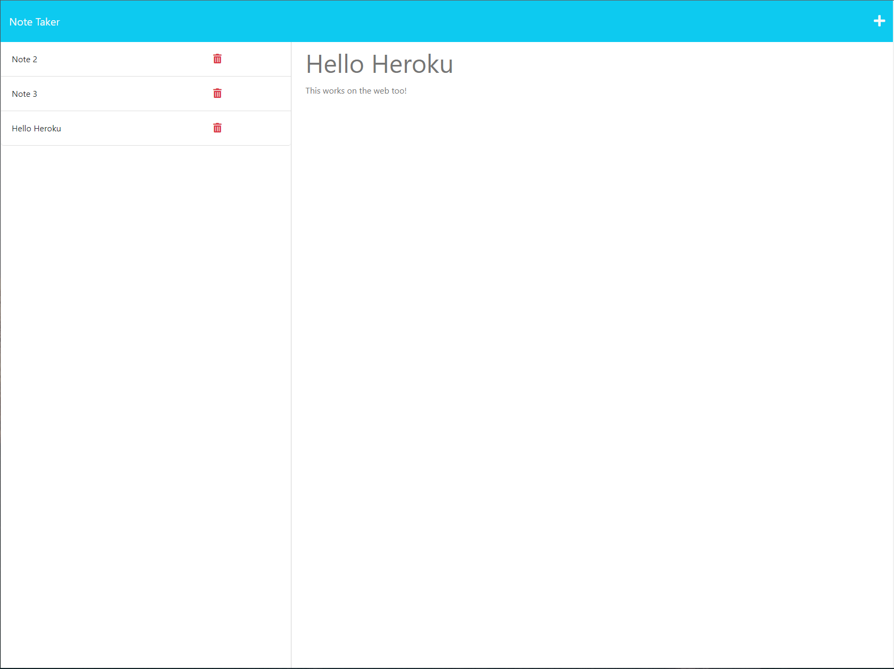
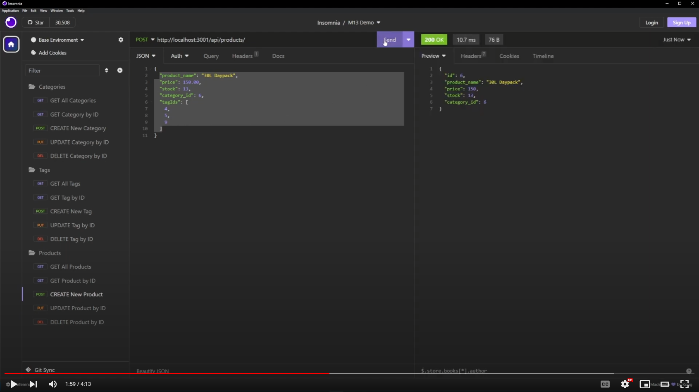
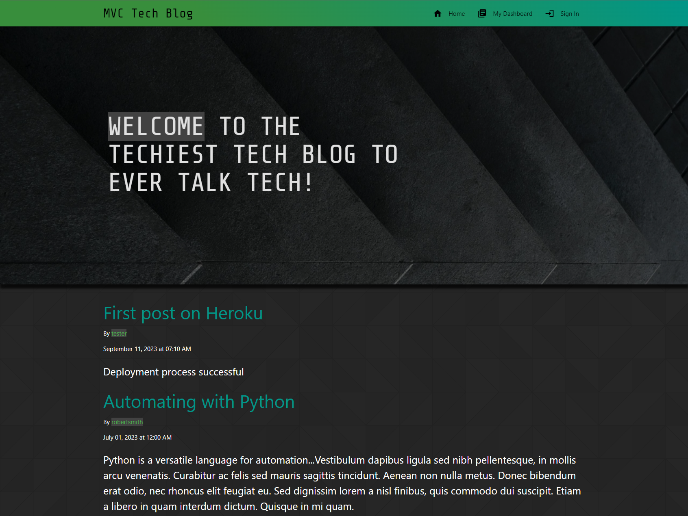
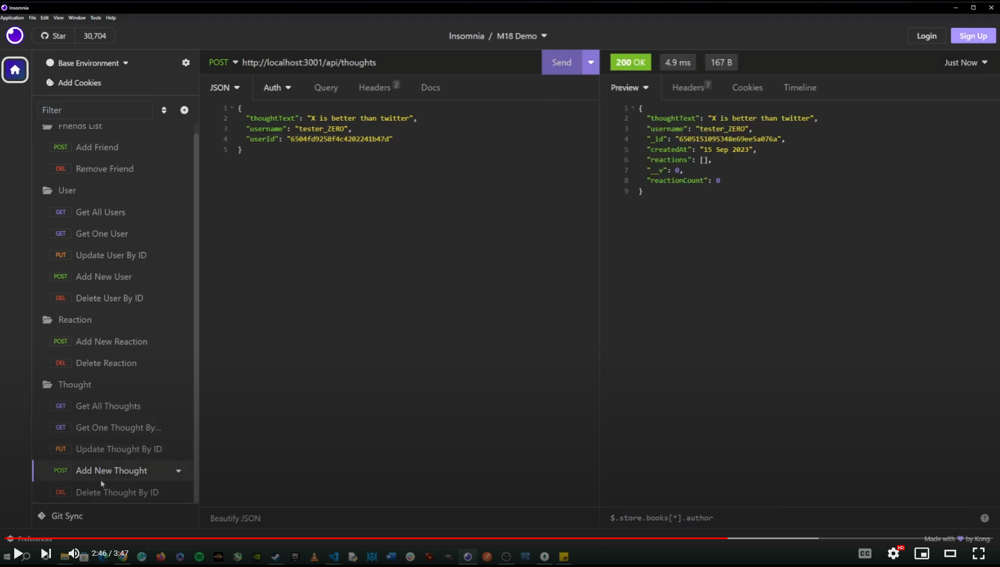
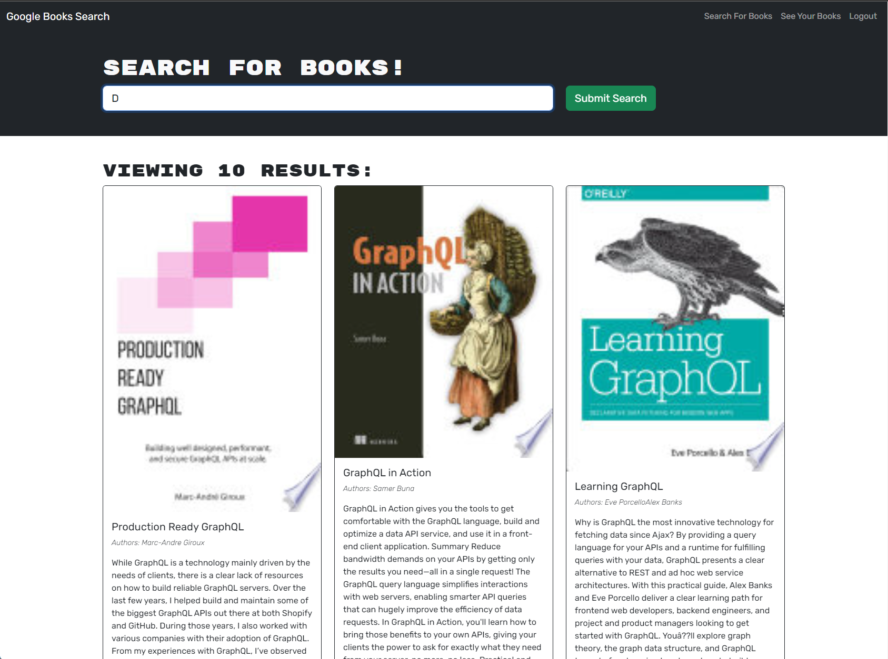

# Bootcamp Challenges
All of my UC Berkeley Full Stack Web Development Bootcamp Challenges consolidated within a monorepo.

## GitHub Pages

Visit the GitHub pages site to see all of the deployments (Under Development): [Bootcamp Challenges](https://torvec.github.io/bootcamp-challenges/)

## Table of Contents
- [Module 00: Pre-Work Study Guide](#module-00-pre-work-study-guide)
- [Module 01: Horiseon Refactor](#module-01-horiseon-refactor)
- [Module 02: My Portfolio (aka Portfolio v1)](#module-02-my-portfolio-aka-portfolio-v1)
- [Module 03: Password Generator](#module-03-password-generator)
- [Module 04: Coding Quiz](#module-04-coding-quiz)
- [Module 05: Workday Scheduler](#module-05-workday-scheduler)
- [Module 06: Weather Dashboard](#module-06-weather-dashboard)
- [Module 07/08: Project 1: Loot Vault](#module-0708-project-1-loot-vault)
- [Module 09: README Generator](#module-09-readme-generator)
- [Module 10: SVG Logo Maker](#module-10-svg-logo-maker)
- [Module 11: Express.js Note Taker](#module-11-expressjs-note-taker)
- [Module 12: MySQL Employee Tracker](#module-12-mysql-employee-tracker)
- [Module 13: ORM E-Commerce Back End](#module-13-orm-e-commerce-back-end)
- [Module 14: MVC Tech Blog](#module-14-mvc-tech-blog)
- [Module 15/16: Project 2: Task Titan](#module-1516-project-2-task-titan)
- [Module 17: Regex Tutorial](#module-17-regex-tutorial)
- [Module 18: NoSQL Social Network API](#module-18-nosql-social-network-api)
- [Module 19: PWA Text Editor](#module-19-pwa-text-editor)
- [Module 20: React Portfolio (aka Portfolio v2)](#module-20-react-portfolio-aka-portfolio-v2)
- [Module 21: MERN Book Search Engine](#module-21-mern-book-search-engine)
- [Module 22: Redux Store (Extra Credit)](#module-22-redux-store-extra-credit)
- [Module 23/24: Project 3: Wedloc](#module-2324-project-3-wedloc)

## Module 00: Pre-Work Study Guide

The purpose of this study guide is to provide a centralized location for notes on the fundamentals of HTML, CSS, Git, and JavaScript, and to offer a hands-on experience in the web development process. By consolidating these resources, learners can gain a comprehensive understanding of the basics of web development and build a strong foundation for future projects.

### Tech Stack
- HTML
- CSS
- Git
- JavaScript

## Module 01: Horiseon Refactor

The week 01 bootcamp challenge was to refactor the HTML and CSS code for the Horiseon company web page. The original code used non-semantic HTML and the CSS had a lot of redundant code that needed to be removed. The overall look of the site remained the same after all of the changes were made but the underlying code was more semantic and efficient.

### Tech Stack
- HTML
- CSS

### Starter Code
[urban-octo-telegram](https://github.com/coding-boot-camp/urban-octo-telegram)

## Module 02: My Portfolio (Portfolio v1)

The week 02 bootcamp challenge was to create a website from scratch with various acceptance criteria that included things like a responsive layout, images of previous projects, a profile pic of yourself, a way to contact you, etc. 

### Tech Stack

- HTML
- CSS

## Module 03: Password Generator

The week 03 bootcamp challenge was to create a password generator using JavaScript with the following requirements: Use prompts and confirms for the user to be able to generate a random password with a length of 8 to 128 characters, with the user choosing what type of characters should be in the password (i.e. uppercase, lowercase, numbers, special characters, etc.).

### Tech Stack
- HTML
- CSS
- JavaScript

### Starter Code
[friendly-parakeet](https://github.com/coding-boot-camp/friendly-parakeet)

## Module 04: Coding Quiz

The week 04 challenge was to create a multiple choice JavaScript quiz that was timed, scored, and kept track of your scores, along with your initials you have to enter, by storing them in the local storage of the browser.

### Tech Stack
- HTML
- CSS
- JavaScript

## Module 05: Workday Scheduler

The week 05 challenge was to create a daily scheduler that was dynamically generated by the user and has features such as the current date, hour blocks that are color coded to indicate if they are past/present/future, and the ability to enter events that will persist in the local storage of the browser.

### Tech Stack
- HTML
- CSS
- JavaScript
- jQuery
- Bootstrap
- Font Awesome
- Google Fonts
- Day.js

### Starter Code

[crispy-octo-meme](https://github.com/coding-boot-camp/crispy-octo-meme)

## Module 06: Weather Dashboard

The week 06 challenge was to create a weather dashboard that was dynamically generated by the user and has features such as the current date, a 5 day forecast, and the ability to enter a city name and have the weather data for that city displayed.

### Tech Stack

- HTML
- CSS
- JavaScript
- API's: OpenWeather Geocoding API, OpenWeather One Call API 3.0
- Google Fonts
- Day.js

## Module 07/08: Project 1: Loot Vault

#### See GitHub Repo: [Loot Vault](https://github.com/Torvec/project_1_Loot_Vault)

## Module 09: README Generator

The week 09 challenge was to create a README generator using NodeJS with the following requirements: Use the Inquirer package to prompt the user for information about their project and then generate a README file based off of the user's input.

### Tech Stack
- JavaScript
- NodeJS
- Inquirer Package

### Starter Code

[potential-enigma](https://github.com/coding-boot-camp/potential-enigma)

## Module 10: SVG Logo Maker

The week 10 challenge was to create an SVG logo maker using NodeJS with the inquirer package and the Jest Testing framework for unit tests. The application prompts the user for the shape, color, and text the logo should be made of and then generates an SVG logo based off of the user's input.

### Tech Stack
- JavaScript
- NodeJS
- Inquirer Package
- Jest Testing Framework

## Module 11: Express.js Note Taker

The week 11 challenge was to create a note taking application using Express.js for the back end and connecting it to an already created front-end.

### Tech Stack
- JavaScript
- NodeJS
- Express.js
- UUID Package
- Heroku

### Starter Code
[miniature-eureka](https://github.com/coding-boot-camp/miniature-eureka)

## Module 12: MySQL Employee Tracker

The week 12 challenge was to create a command line application that allows the user to view and manage the departments, roles, and employees in a company. The application uses NodeJS, the Inquirer package, and the MySQL package to connect to a MySQL database and perform CRUD operations on the database.

### Tech Stack
- JavaScript
- NodeJS
- Inquirer Package
- MySQL2 Package
- MySQL Database
- dotenv Package

## Module 13: ORM E-Commerce Back End

The week 13 challenge was to create a back end for an e-commerce site using express.js and sequelize to interact with a MySQL database and demonstrate the functionality of the application using Insomnia Core.

### Tech Stack
- JavaScript
- NodeJS
- Express.js
- Sequelize
- MySQL Database
- dotenv Package

### Starter Code
[fantastic-umbrella](https://github.com/coding-boot-camp/fantastic-umbrella)

## Module 14: MVC Tech Blog

The week 14 challenge was to create a tech blog using the MVC paradigm. 

### Tech Stack
- JavaScript
- NodeJS
- Express.js
- express-session Package
- Sequelize
- connect-session-sequelize Package
- MySQL2 Package
- MySQL Database
- dotenv Package
- express-handlebars Package
- Materialize CSS
- day.js Package
- bcrypt Package
- Heroku

## Module 15/16: Project 2: Task Titan

See GitHub Repo: [Task Titan](https://github.com/Torvec/Task-Titan)

## Module 17: Regex Tutorial

See Gist: [Regex Tutorial](https://gist.github.com/torvec/675b4465926a137bc9410f8b180f7469)

## Module 18: NoSQL Social Network API

The week 18 challenge was to create a back end for a social networking API using express.js and Mongoose to interact with a MongoDB database and demonstrate the functionality of the application using Insomnia.

### Tech Stack
- JavaScript
- NodeJS
- Express.js
- Mongoose
- MongoDB Database

## Module 19: PWA Text Editor

The week 19 challenge was to Progressive Web App (PWA) text editor

### Tech Stack
- JavaScript
- NodeJS
- Express.js
- idb Package
- Babel
- Webpack
- Code Mirror Package
- Heroku

### Starter Code

[cautious-meme](https://github.com/coding-boot-camp/cautious-meme/tree/main)

## Module 20: React Portfolio (Portfolio v2)

The week 20 bootcamp challenge was to create another portfolio website but this time using React. I took it a little further and went with Vite and added on Tailwind CSS just to make things more challenging.

### Tech Stack
- React
- React Router
- Vite
- Tailwind CSS
- JSX
- Prettier
- ESLint
- Autoprefixer Package
- PostCSS Package

## Module 21: MERN Book Search Engine

The week 21 challenge was to create a book search engine using the MERN stack and refactoring it from using a RESTful API to a GraphQL API.

### Tech Stack
- React
- React Router
- Vite
- Express.js
- GraphQL
- MongoDB Database
- Mongoose
- Apollo Server
- Apollo Client
- JWT
- Bcrypt
- Bootstrap

### Starter Code

[solid-broccoli](https://github.com/coding-boot-camp/solid-broccoli)

## Module 22: Redux Store (Extra Credit)

UNDER DEVELOPMENT

## Module 23/24: Project 3: Wedloc

See GitHub Repo: [Wedloc](https://github.com/Torvec/wedloc)
