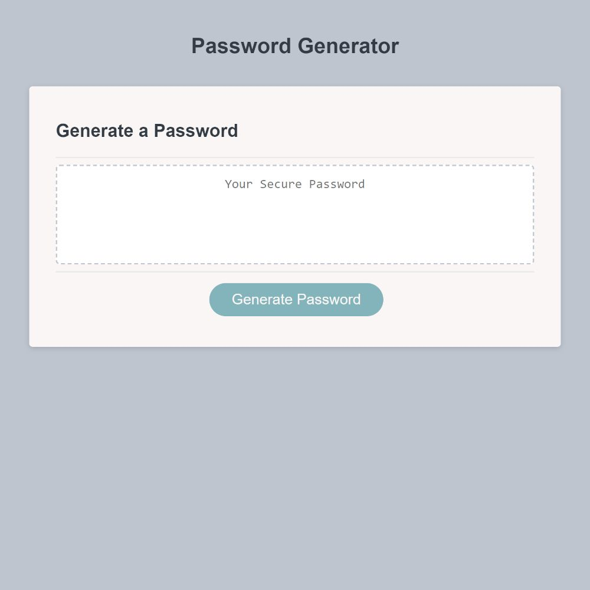

# Module 03: Password Generator

The week 03 bootcamp challenge was to create a password generator using JavaScript with the following requirements: Use prompts and confirms for the user to be able to generate a random password with a length of 8 to 128 characters, with the user choosing what type of characters should be in the password (i.e. uppercase, lowercase, numbers, special characters, etc.).

## Tech Stack
- HTML
- CSS
- JavaScript

## Starter Code
[friendly-parakeet](https://github.com/coding-boot-camp/friendly-parakeet)