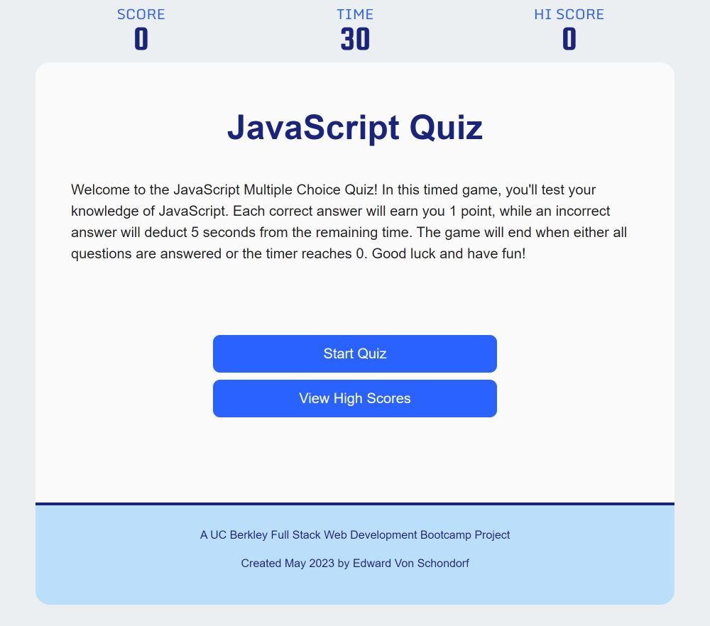

# Module 04: Coding Quiz

The week 04 challenge was to create a multiple choice JavaScript quiz that was timed, scored, and kept track of your scores, along with your initials you have to enter, by storing them in the local storage of the browser.

## Tech Stack
- HTML
- CSS
- JavaScript