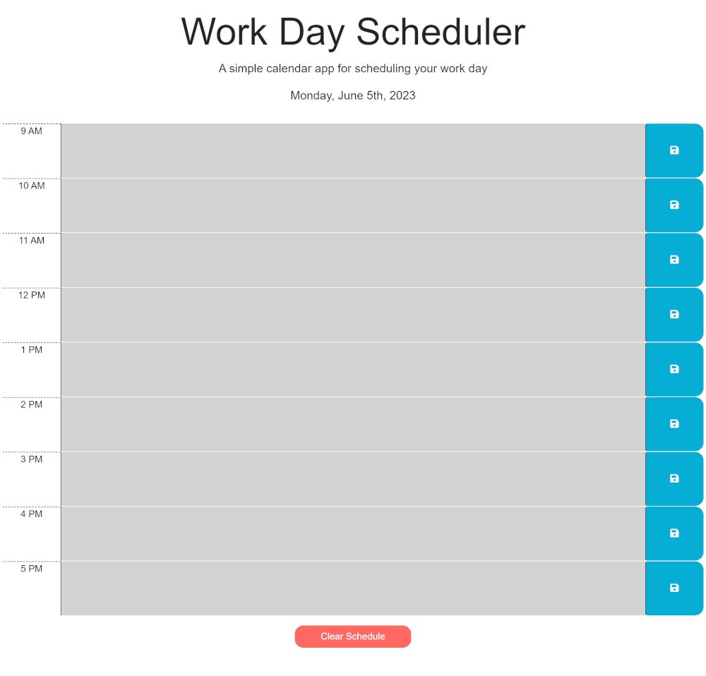

# Module 05: Workday Scheduler

The week 05 challenge was to create a daily scheduler that was dynamically generated by the user and has features such as the current date, hour blocks that are color coded to indicate if they are past/present/future, and the ability to enter events that will persist in the local storage of the browser.

## Tech Stack
- HTML
- CSS
- JavaScript
- jQuery
- Bootstrap
- Font Awesome
- Google Fonts
- Day.js

## Starter Code

[crispy-octo-meme](https://github.com/coding-boot-camp/crispy-octo-meme)