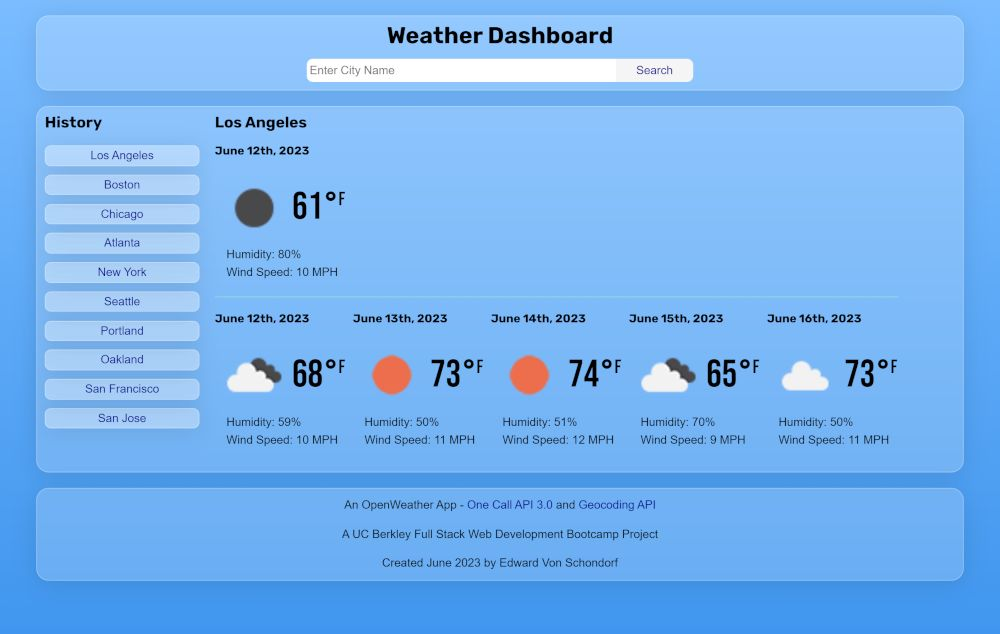

# Module 06: Weather Dashboard

The week 06 challenge was to create a weather dashboard that was dynamically generated by the user and has features such as the current date, a 5 day forecast, and the ability to enter a city name and have the weather data for that city displayed.

## Tech Stack

- HTML
- CSS
- JavaScript
- API's: OpenWeather Geocoding API, OpenWeather One Call API 3.0
- Google Fonts
- Day.js