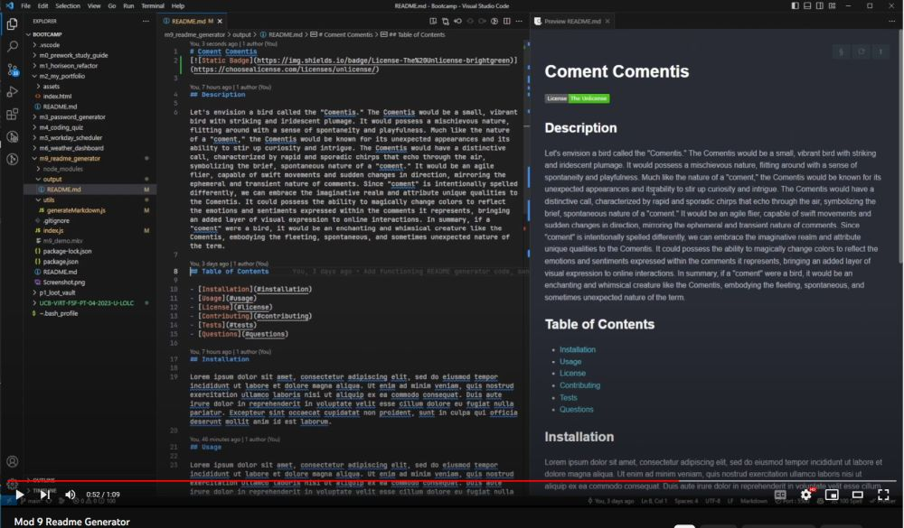

# Module 09: README Generator

The week 09 challenge was to create a README generator using NodeJS with the following requirements: Use the Inquirer package to prompt the user for information about their project and then generate a README file based off of the user's input.

## Tech Stack
- JavaScript
- NodeJS
- Inquirer Package

## Starter Code

[potential-enigma](https://github.com/coding-boot-camp/potential-enigma)
