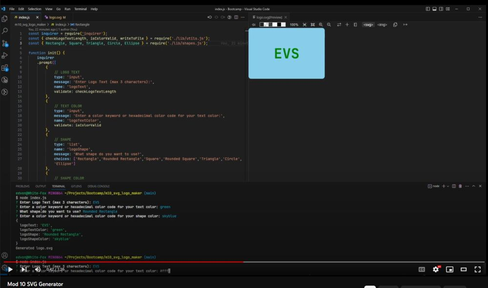

# Module 10: SVG Logo Maker

The week 10 challenge was to create an SVG logo maker using NodeJS with the inquirer package and the Jest Testing framework for unit tests. The application prompts the user for the shape, color, and text the logo should be made of and then generates an SVG logo based off of the user's input.

## Tech Stack
- JavaScript
- NodeJS
- Inquirer Package
- Jest Testing Framework