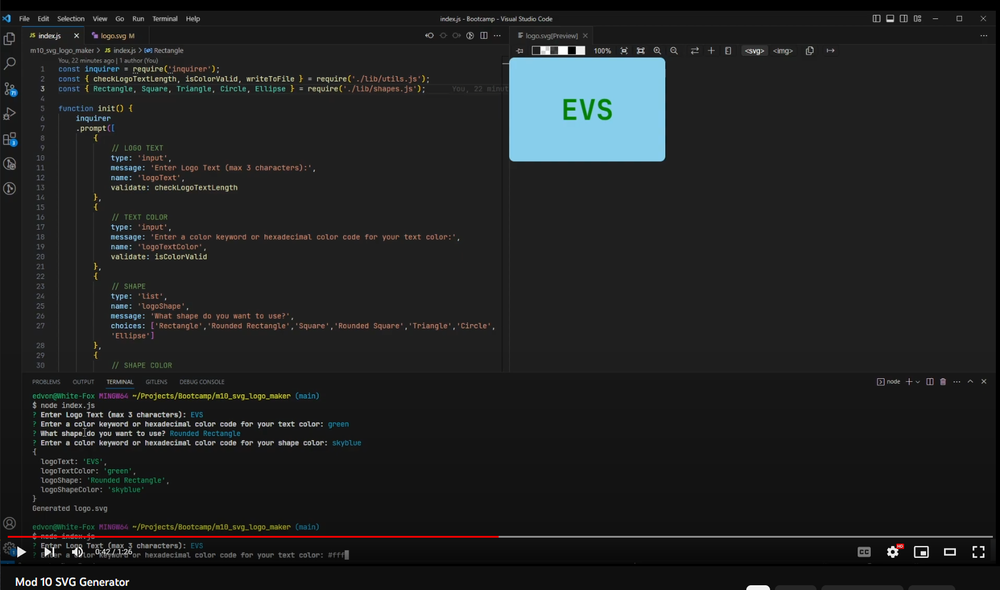

# SVG Logo Maker
A UC Berkley Full Stack Web Development Bootcamp Week 10 Challenge

## Description

The week 10 challenge was to create an SVG logo maker using NodeJS with the inquirer package and the Jest Testing framework for unit tests. The application prompts the user for the shape, color, and text the logo should be made of and then generates an SVG logo based off of the user's input.

## Demonstration

[Youtube Link](https://youtu.be/CGi1bugTEi8)

## Usage

This page is used for grading purposes by the UC Berkley coding bootcamp staff.

## Credits

- Jest Testing Framework: [Jest](https://jestjs.io/)
- Inquirer Package: [Inquirer](https://www.npmjs.com/package/inquirer)
- MDN Network: [SVG Tutorial](https://developer.mozilla.org/en-US/docs/Web/SVG/Tutorial)
- Edward Von Schondorf

## Features

- Creates an SVG Logo based off of user input using NodeJS and the Inquirer package along with the Jest testing framework.
- Can create the following shapes: Rectangle, Rounded Rectangle, Square, Rounded Square, Triangle, Circle, and Ellipse

## Project Status

Completed July 2023 