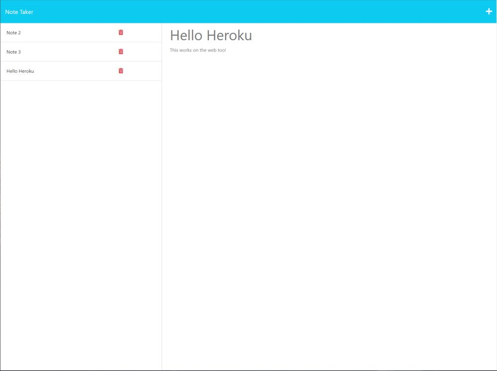

# Module 11: Express.js Note Taker

The week 11 challenge was to create a note taking application using Express.js for the back end and connecting it to an already created front-end.

## Tech Stack
- JavaScript
- NodeJS
- Express.js
- UUID Package
- Heroku

## Starter Code
[miniature-eureka](https://github.com/coding-boot-camp/miniature-eureka)