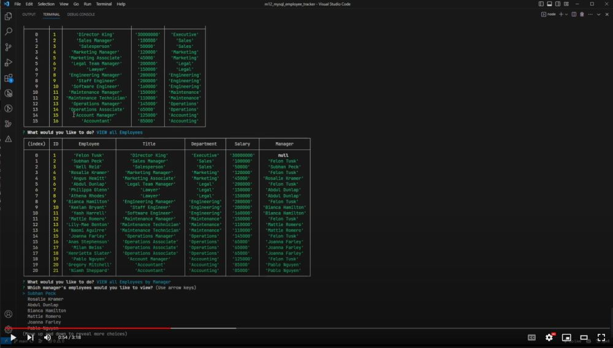

# Module 12: MySQL Employee Tracker

The week 12 challenge was to create a command line application that allows the user to view and manage the departments, roles, and employees in a company. The application uses NodeJS, the Inquirer package, and the MySQL package to connect to a MySQL database and perform CRUD operations on the database.

## Tech Stack
- JavaScript
- NodeJS
- Inquirer Package
- MySQL2 Package
- MySQL Database
- dotenv Package