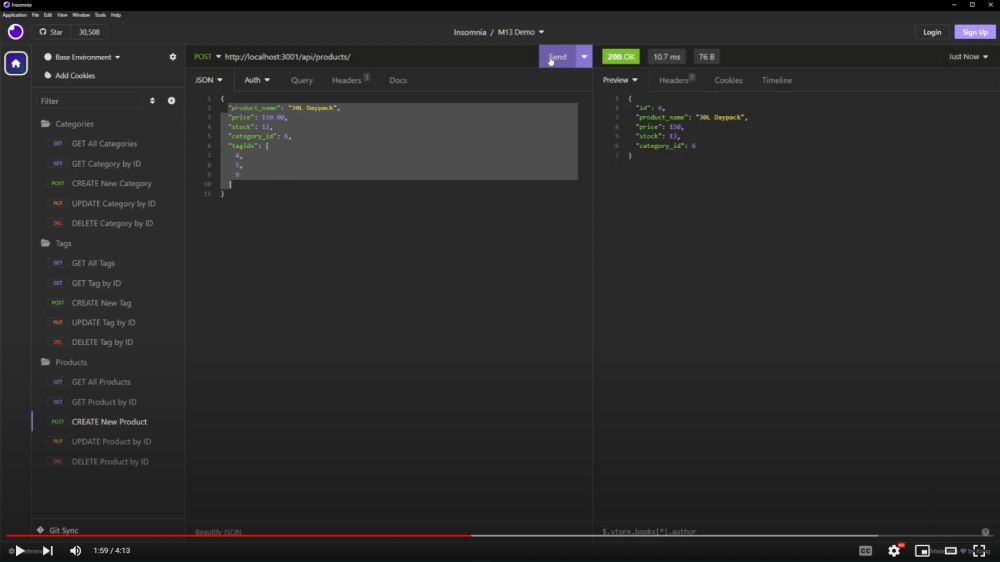

# Module 13: ORM E-Commerce Back End

The week 13 challenge was to create a back end for an e-commerce site using express.js and sequelize to interact with a MySQL database and demonstrate the functionality of the application using Insomnia Core.

## Tech Stack
- JavaScript
- NodeJS
- Express.js
- Sequelize
- MySQL Database
- dotenv Package

## Starter Code
[fantastic-umbrella](https://github.com/coding-boot-camp/fantastic-umbrella)