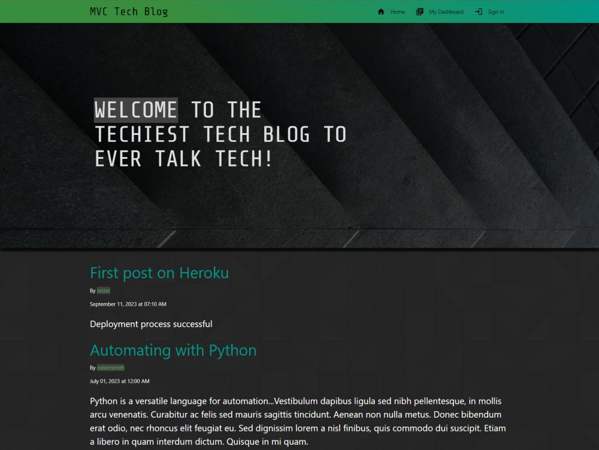

# Module 14: MVC Tech Blog

The week 14 challenge was to create a tech blog using the MVC paradigm. 

## Tech Stack
- JavaScript
- NodeJS
- Express.js
- express-session Package
- Sequelize
- connect-session-sequelize Package
- MySQL2 Package
- MySQL Database
- dotenv Package
- express-handlebars Package
- Materialize CSS
- day.js Package
- bcrypt Package
- Heroku