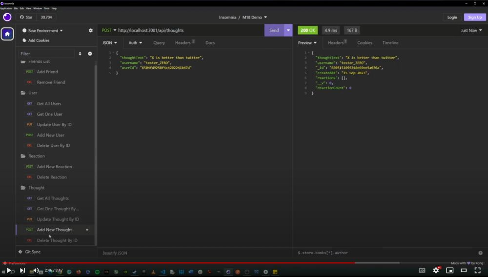

# Module 18: NoSQL Social Network API

The week 18 challenge was to create a back end for a social networking API using express.js and Mongoose to interact with a MongoDB database and demonstrate the functionality of the application using Insomnia.

## Tech Stack
- JavaScript
- NodeJS
- Express.js
- Mongoose
- MongoDB Database

