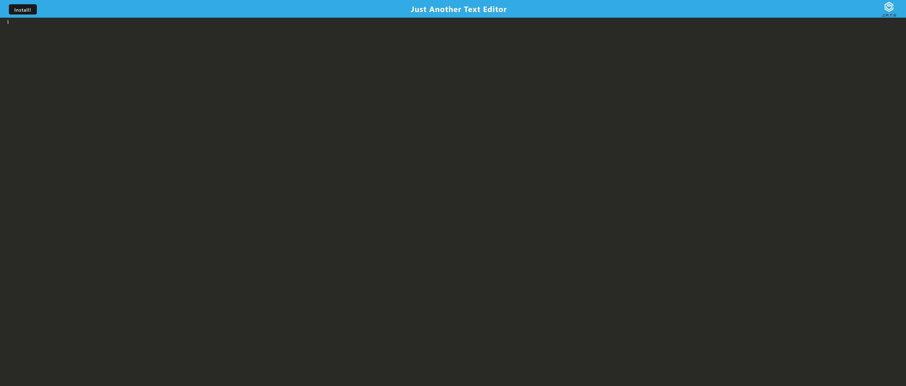

# Tech Blog
A UC Berkley Full Stack Web Development Bootcamp Week 19 Challenge

## Description

The week 19 challenge was to Progressive Web App (PWA) text editor

## Heroku Deployment

[PWA Text Editor](https://protected-everglades-54484-89ec2b86b857.herokuapp.com/)

## Visuals

## Usage

This page is used for grading purposes by the UC Berkley coding bootcamp staff.

## Credits

- idb package: [idb](https://www.npmjs.com/package/idb)
- webpack: [webpack](https://webpack.js.org/)
- babel: [babel](https://babeljs.io/)
- code-miror: [code-mirror](https://codemirror.net/)
- Starter Code [cautious-meme](https://github.com/coding-boot-camp/cautious-meme/tree/main)
- Edward Von Schondorf

## Features

- Can install as a PWA to edit text online or offline

## Project Status

Completed September 2023