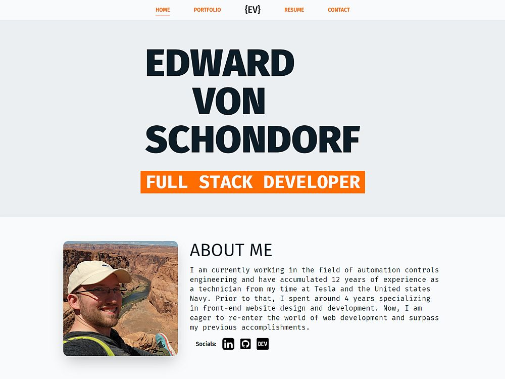

# Module 20: React Portfolio (Portfolio v2)

The week 20 bootcamp challenge was to create another portfolio website but this time using React. I took it a little further and went with Vite and added on Tailwind CSS just to make things more challenging.

## Tech Stack
- React
- React Router
- Vite
- Tailwind CSS
- JSX
- Prettier
- ESLint
- Autoprefixer Package
- PostCSS Package