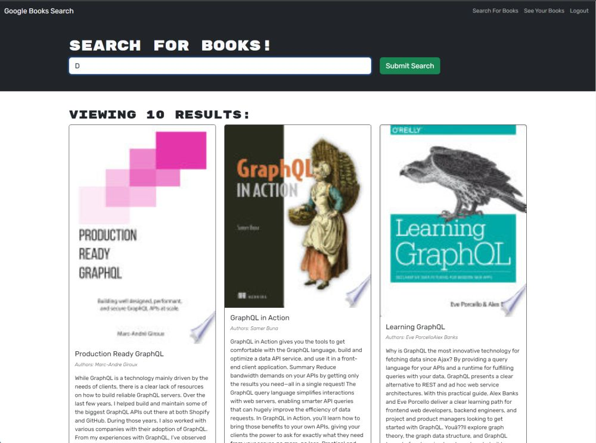

# Module 21: MERN Book Search Engine

The week 21 challenge was to create a book search engine using the MERN stack and refactoring it from using a RESTful API to a GraphQL API.

### Tech Stack
- React
- React Router
- Vite
- Express.js
- GraphQL
- MongoDB Database
- Mongoose
- Apollo Server
- Apollo Client
- JWT
- Bcrypt
- Bootstrap

## Starter Code

[solid-broccoli](https://github.com/coding-boot-camp/solid-broccoli)