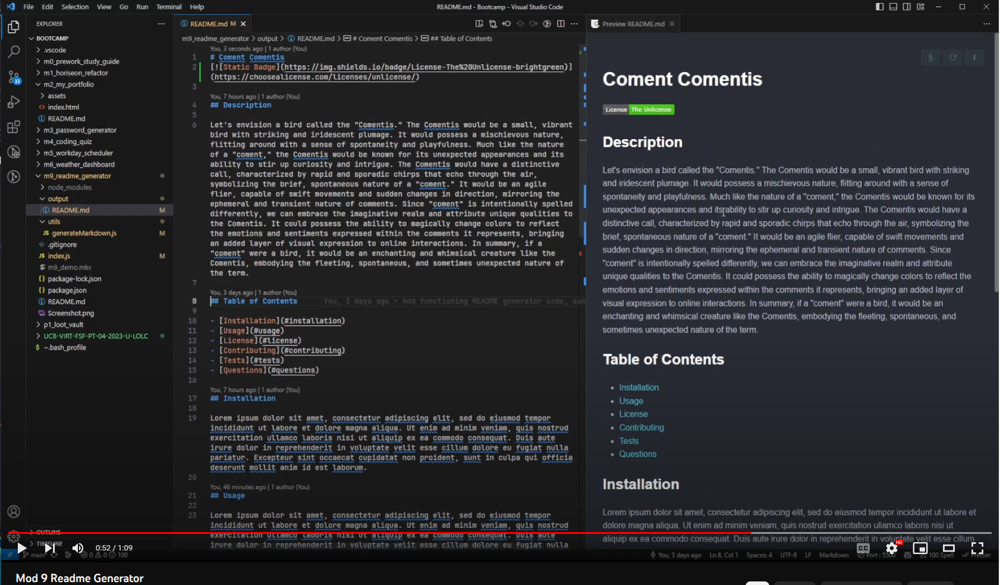

# README Generator
A UC Berkley Full Stack Web Development Bootcamp Week 09 Challenge

## Description

The week 09 challenge was to create a README generator using NodeJS with the following requirements: Use the Inquirer package to prompt the user for information about their project and then generate a README file based off of the user's input.

## GitHub Pages

N/A - This is a NodeJS command line application

## Demonstration

[Youtube Link](https://youtu.be/GUlMvpk-Ono)

## Usage

This page is used for grading purposes by the UC Berkley coding bootcamp staff.

## Credits

- Starter Code: [Potential-Enigma](https://github.com/coding-boot-camp/potential-enigma)
- Inquirer Package: [Inquirer](https://www.npmjs.com/package/inquirer)
- Static Badge: [Static Badge](https://shields.io/badges/static-badge)
- Edward Von Schondorf

## Features

- Creates a README file based off of user input using NodeJS and the Inquirer package

## Project Status

Completed July 2023